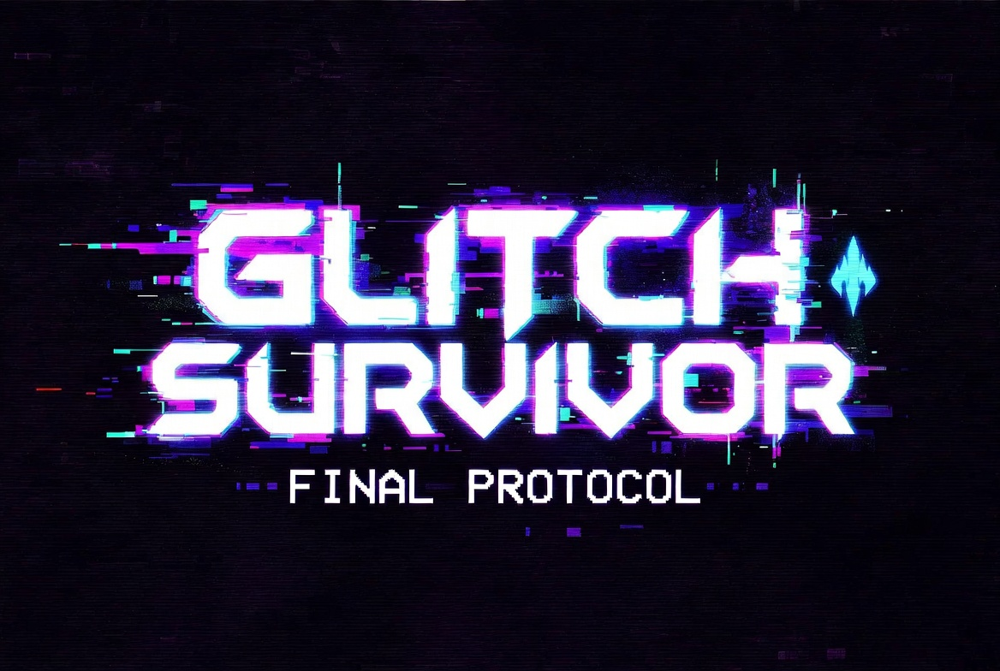

# GLITCH SURVIVOR: FINAL PROTOCOL

<!-- splarg-storefront:start -->

  <strong><a href="https://splarg.itch.io/glitch-survivor-final-protocol">▶ Play in browser on itch.io</a></strong>

  <a href="https://splarg.itch.io/glitch-survivor-final-protocol">Screenshots & current public release</a> · <a href="https://splarg.com/">splarg.com</a>

<!-- splarg-storefront:end -->

<!-- splarg-itch-media:start -->

  

<!-- splarg-itch-media:end -->

A neon/CRT-styled browser survival shooter by **Splarg**.

Move, aim and fire independently while enemies close in from the arena. A run is measured by **score, kills and survival time**, with the best score kept locally in the browser.

**Play on itch.io:** https://splarg.itch.io/glitch-survivor-final-protocol

## Controls

The game supports touch, keyboard and gamepad.

- **Left thumb / movement controls** — move
- **Right thumb / aim controls** — aim and fire
- **Pause button / Esc / gamepad Start** — pause or resume
- **M** — mute

The title screen also retains the previous run's score, kills and survival time.

## Run locally

There is no build step. Open the root `index.html` in a modern browser.

## Source status

The root `index.html` corresponds to the preserved itch.io release checked on **19 September 2026**. Where the archival copy differed from the supplied itch file, the differences were whitespace-only; executable source was otherwise unchanged.

Future fixes and development should be committed after that snapshot so the published-release state remains recoverable in Git history.

## Technology

HTML5 Canvas / CSS / JavaScript / Web Audio.
